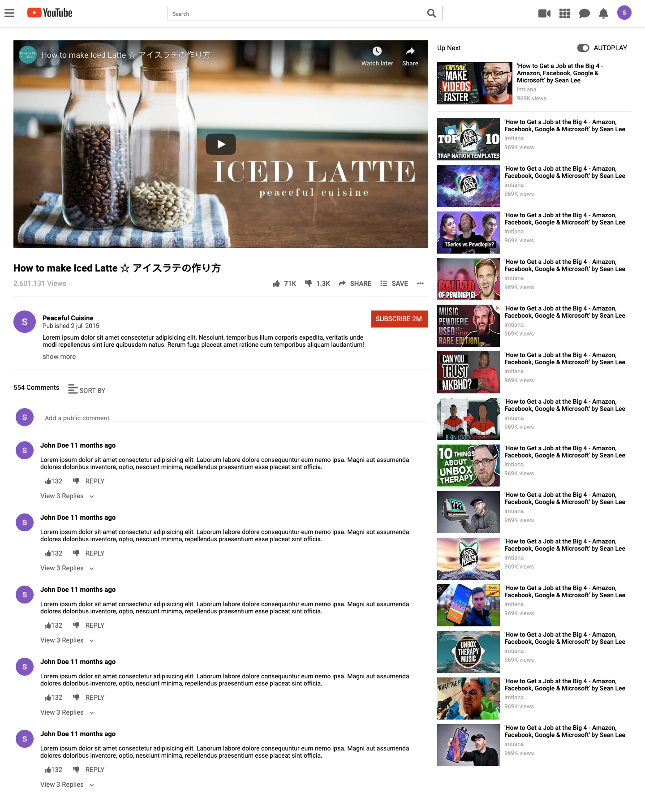

# [youtube_clone](https://raw.githack.com/KaushikShivam/youtube_clone/feature-navigation/index.html)



## Table of content
- [Description](#description)
- [Installation](#installation)
- [Contact](#contact)

## Description
This is a [Youtube Clone](https://raw.githack.com/rociac/forms-project/development/index.htm) project that we worked on for Microverse.
It uses HTML5 and CSS3.


## Installation

1. Clone the project to your local directory
```
git clone https://github.com/KaushikShivam/youtube_clone.git
```
2. Open the index.html file in your browser to view the website in all its glory (Live-server is recommended to view live changes automatically)

## Contact
This template was created in collaboration with Rodolfo and myself
You can contact me at:

- [Portfolio](https://www.shivamkaushik.com)
- [Email](mailto:shivamkaushikofficial@gmail.com)
- [Linkedin](https://www.linkedin.com/in/kshivamdev/)
- [Twitter](https://twitter.com/kShivamDev)
- [Medium](https://medium.com/@shivamkaushikofficial)
- [Angellist](https://angel.co/kshivamdev)

You can contact Rodolfo at:
- [Email](acosta.rodolfo.rca@gmail.com)

